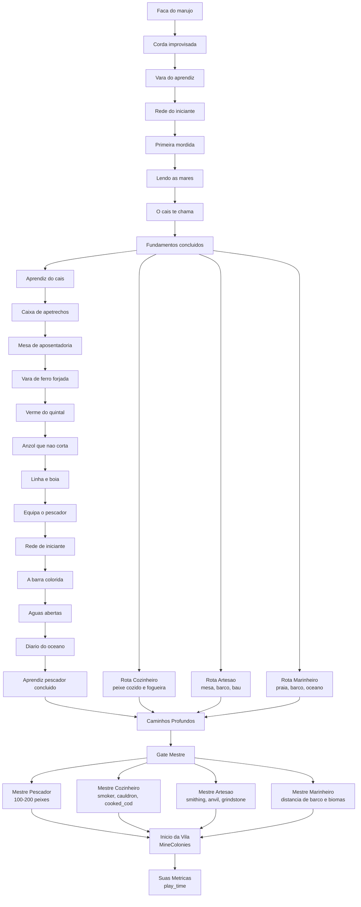
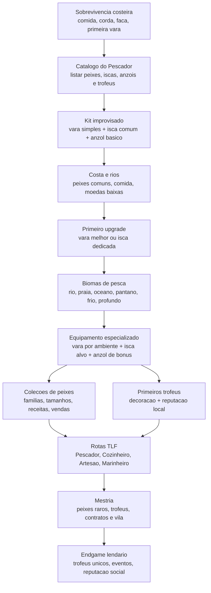

# Progressao

> Documento para detalhar tiers, insignias, desbloqueios e requisitos. Fonte central: [`../manifests/vision.md`](../manifests/vision.md).

## Tiers

| Tier | Multiplicador |
|------|---------------|
| LOW | 0.6x |
| MEDIUM | 1.0x |
| GOOD | 1.2x |
| GREAT | 1.5x |
| EXCELLENT | 2.0x |
| PERFECT | 3.0x |
| LEGENDARY | 5.0x |

## Ritmo de progressao

| Etapa | Ritmo |
|-------|-------|
| LOW -> MEDIUM | rapido |
| MEDIUM -> GOOD | moderado |
| GOOD -> GREAT | lento |
| GREAT -> EXCELLENT | dificil |
| EXCELLENT -> PERFECT | muito raro |
| PERFECT -> LEGENDARY | endgame social |

## Insignias

Insignias sao marcos oficiais de progressao e representam reconhecimento. Elas devem funcionar como itens fisicos, chaves de progressao e simbolos visuais de reputacao.

## Desbloqueios

TBD: mapear desbloqueios por tier, rota e sistema.

## Requisitos

TBD: consolidar requisitos por rota a partir dos manifestos em [`../manifests/`](../manifests/).

## Fluxo atual

Estado implementado hoje em FTB Quests: Intro expandido para 8 passos, rota Pescador Aprendiz expandida para 13 passos, quatro rotas em paralelo, fase mestre, fundacao de vila e metricas finais. O sistema KubeJS de tiers existe, mas esta temporariamente pausado para validar os mods novos sem interferencia. A rede de pesca foi reativada em modo minimo para introduzir peixes como entidades.

## Proposta refeita com os mods novos

A progressao deve sair de "quantidade de peixes" como eixo principal e passar a medir dominio de equipamento, ecossistemas e trofeus. Varas, iscas e anzois devem ser camadas complementares:

- Varas definem alcance de tier/ambiente.
- Iscas direcionam familia de peixe, raridade ou bioma.
- Anzois modulam risco/recompensa, durabilidade, captura especial ou chance de trofeu.
- Peixes variados viram colecao, economia e culinaria.
- Trofeus viram marcos de reputacao, decoracao e chaves de quests.

## Regras de design para a nova progressao

- Evitar depender de sistemas KubeJS pausados. A excecao atual e `kubejs:fishing_net`, reativado em modo minimo para ensinar captura de peixe-entidade.
- Cada quest de pesca deve declarar se pede captura, entrega, colecao, equipamento ou trofeu.
- Trofeus devem ser raros, visiveis e reaproveitados como requisito de reputacao, nao apenas como loot vendavel.
- Iscas e anzois devem aparecer cedo o suficiente para o jogador entender que pesca nao e so spam de vara.
- A vila deve consumir resultados da pesca: comida, decoracao, contratos, trofeus e suprimentos.

## Rede de pesca minima

Arquivo ativo: `kubejs/server_scripts/items/fishing_net_minimal.js`.

Escopo atual:

- registra `kubejs:fishing_net` em `kubejs/startup_scripts/items/fishing_net.js`;
- captura entidades vanilla `minecraft:cod`, `minecraft:salmon`, `minecraft:tropical_fish` e `minecraft:pufferfish`;
- entrega o item equivalente ao jogador;
- remove a entidade capturada;
- nao aplica tiers, durabilidade especial, raridade ou conversao de peixes de mods ainda.

## Referencias

- [`../manifests/manifestos_tlf_rotas_e_progressao.md`](../manifests/manifestos_tlf_rotas_e_progressao.md)
- [`routes.md`](./routes.md)
- [`endgame.md`](./endgame.md)
- Tecnico: [`../internal-docs/ftb-quests-progressao-tlf.md`](../internal-docs/ftb-quests-progressao-tlf.md)
- Tecnico: [`../internal-docs/fish-tier-system.md`](../internal-docs/fish-tier-system.md)
- Tecnico: [`../internal-docs/fishing-loot-system.md`](../internal-docs/fishing-loot-system.md)
- Tecnico: [`../internal-docs/crash-ftbquests-teamdata-2026-05-25.md`](../internal-docs/crash-ftbquests-teamdata-2026-05-25.md)
