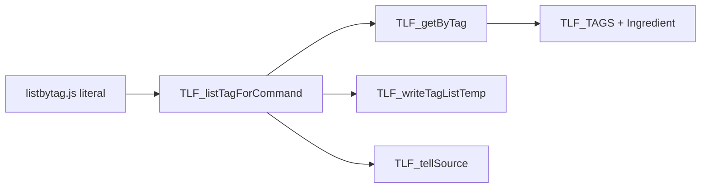

# TLF — documentação interna do projeto KubeJS

Mapa do que foi feito no modpack **The Legendary Fishman**, foco em scripts servidor para peixes/tags.

## Ponto de entrada da documentacao

Antes de refatorar sistemas, quests, economia, progressao ou lista de mods, use [`../manifests/vision.md`](../manifests/vision.md) como fonte da verdade e [`../README.md`](../README.md) como mapa geral da pasta `.cursor/`.

Documentos de direcao relacionados:

- Identidade do modpack: [`../manifests/identity.md`](../manifests/identity.md)
- Arquitetura ideal: [`../architecture/architecture.md`](../architecture/architecture.md)
- Auditoria inicial de mods: [`../architecture/mods-audit.md`](../architecture/mods-audit.md)
- Riscos tecnicos: [`../architecture/risks.md`](../architecture/risks.md)
- Conflitos conceituais: [`../architecture/conflicts.md`](../architecture/conflicts.md)
- Gameplay loop: [`../gameplay/gameplay-loop.md`](../gameplay/gameplay-loop.md)
- Progressao: [`../gameplay/progression.md`](../gameplay/progression.md)
- Rotas: [`../gameplay/routes.md`](../gameplay/routes.md)
- Pacing e economia: [`../gameplay/pacing-economy.md`](../gameplay/pacing-economy.md)

## Estrutura no repositório

```
kubejs/
├── server_scripts/
│   ├── constants/tags.js       → mapa de atalhos
│   ├── utils/
│   │   ├── tell_source.js      → mensagens no chat
│   │   ├── get_by_tag.js       → resolve tag e coleta IDs
│   │   ├── write_temp.js       → grava .txt temporário
│   │   └── list_tag_result.js  → orquestra listagem completa
│   └── commands/listbytag.js   → registro Brigadier (literais)
├── config/temp/                → saída dos comandos
└── client_scripts/             → tooltips (fora do fluxo listbytag)

.cursor/
├── README.md                    → mapa geral de docs/config dos agentes IA
├── manifests/
│   ├── vision.md                → fonte da verdade do TLF Vision Refactor
│   ├── identity.md              → identidade extraida dos manifestos
│   └── manifesto_*.md           → manifestos de rotas e progressao
├── architecture/
│   ├── architecture.md          → arquitetura ideal
│   ├── mods-audit.md            → auditoria estruturada de mods
│   ├── risks.md                 → riscos tecnicos
│   └── conflicts.md             → conflitos conceituais
├── gameplay/
│   ├── gameplay-loop.md         → loop principal
│   ├── progression.md           → tiers, insignias e desbloqueios
│   ├── endgame.md               → objetivo final e conteudo repetivel
│   ├── reputation.md            → reputacao e reconhecimento
│   ├── routes.md                → quatro rotas de especializacao
│   ├── legends.md               → Lendas do Mar
│   └── pacing-economy.md        → ritmo e economia
├── kubejs-docs/
│   └── kubejs-origin-command.md → APIs KubeJS + fontes oficiais
└── internal-docs/               → esta pasta
```

## Documentos por componente

| Arquivo | Conteúdo |
|---------|----------|
| [tags-constants.md](./tags-constants.md) | `TLF_TAGS` e atalhos |
| [tell-source.md](./tell-source.md) | `TLF_tellSource` |
| [get-by-tag.md](./get-by-tag.md) | `TLF_getByTag` |
| [write-temp.md](./write-temp.md) | `TLF_writeTagListTemp` |
| [list-tag-result.md](./list-tag-result.md) | `TLF_listTagForCommand` |
| [listbytag-command.md](./listbytag-command.md) | Comando `/listbytag` |
| [pescavel-loot.md](./pescavel-loot.md) | Tag `pescavel` / loot de pesca |
| [fish-tier-system.md](./fish-tier-system.md) | Tiers TLF em peixes, varas e rede |
| [fishing-loot-system.md](./fishing-loot-system.md) | Loot de pesca influenciado pela vara |
| [ftb-quests-progressao-tlf.md](./ftb-quests-progressao-tlf.md) | Cadeia real de quests/progressao |

## Ordem de carregamento (priority)

| priority | Arquivo |
|----------|---------|
| 100 | `constants/tags.js` |
| 95 | `utils/tell_source.js` |
| 90 | `utils/get_by_tag.js` |
| 85 | `utils/write_temp.js` |
| 80 | `utils/list_tag_result.js` |
| 0 | `commands/listbytag.js` |

## Fluxo `/listbytag peixes`



## FTB Quests (SNBT)

| Arquivo | Conteúdo |
|---------|----------|
| [ftb-quests-snbt-guide.md](./ftb-quests-snbt-guide.md) | Todos os tipos de task/reward + exemplos SNBT |
| `config/ftbquests/quests/chapters/tlf_snbt_reference.snbt` | Capítulo de referência no jogo |

## Referência externa

APIs e links oficiais: [.cursor/kubejs-docs/kubejs-origin-command.md](../kubejs-docs/kubejs-origin-command.md)
