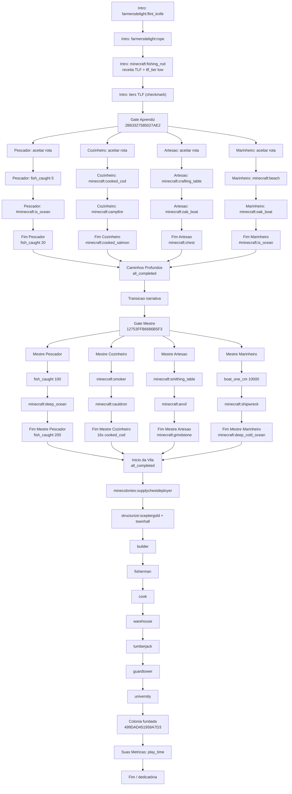

# FTB Quests — fluxo de progressão TLF

Mapa da cadeia implementada em `config/ftbquests/quests/`. Revisado em modo corretivo/idempotente contra os capítulos reais, chaves de idioma e IDs públicos KubeJS.

## Relacionados

- Gameplay: [`../gameplay/progression.md`](../gameplay/progression.md), [`../gameplay/routes.md`](../gameplay/routes.md), [`../gameplay/gameplay-loop.md`](../gameplay/gameplay-loop.md)
- Tecnico: [`ftb-quests-snbt-guide.md`](./ftb-quests-snbt-guide.md), [`fish-tier-system.md`](./fish-tier-system.md), [`fishing-loot-system.md`](./fishing-loot-system.md)

## Diagrama

## Grupos de abas

| Grupo exibido (`pt_br`) | ID | Capítulos |
|--------------------------|-----|-----------|
| *(sem grupo)* | — | Intro |
| Aprendiz | `14CBBE38ED185C1E` | Pescador, Artesão, Marinheiro, Cozinheiro |
| Jornada | `7A2B9C1D4E6F8091` | Caminhos Profundos |
| Mestre | `4FD42C8A70C3F177` | Mestre × 4 |
| Vivemos da Pesca! | `50D79C43CF4E56EF` | Início da Vila, Suas Métricas |

Os títulos crus em `chapter_groups.snbt` ainda são nomes temporários (`Primordios`, `Terminou o Tutorial!!`, `Progressão Infinita?`), mas `lang/pt_br.snbt` os sobrescreve via `chapter_group.<id>.title`.

## Gates (quests-chave)

| ID | Função |
|----|--------|
| `2B63327585027AE2` | Básico feito → libera Aprendiz (4 vertentes em paralelo) |
| `7BF920AB7D7891D4`, `0DEF33350ECF598C`, `034F98C3AF90CD51`, `0B7DBA167854991E` | Finais Aprendiz → Caminhos Profundos |
| `12753FFB6686B5F3` | Portão Mestre → libera abas Mestre (4 vertentes em paralelo) |
| `357E90BE5994BAE2` … `0483799ED346B468` | Finais Mestre → colônia |
| `499DAD451959A7D3` | Colônia fundada → métricas / dedicatória |

## Validacao de IDs apos refatoracao KubeJS

- As quests atuais nao referenciam `global.TLF_*` nem IDs de script; a refatoracao para `global.TLF` nao quebra tasks SNBT diretamente.
- A task de vara usa `minecraft:fishing_rod`, coerente com KubeJS: `startup_scripts/items/fishing_rod_tlf.js` altera a durabilidade da vara vanilla para 10, e `server_scripts/recipes/fishing_rod_tlf.js` recria a receita com ID de receita `tlf:improvised_fishing_rod` e NBT `tlf_tier:"low"`.
- `kubejs:fishing_net` existe em `startup_scripts/items/fishing_net.js`, mas ainda nao aparece em quests; isso permanece como pendencia de design, nao como ID quebrado.
- Tiers de peixe/vara/rede usam NBT `tlf_tier`, nao IDs separados por tier. Tasks de FTB Quests por tier devem usar filtro/componentes NBT ou outro mecanismo de progressao quando forem implementadas.
- Tags publicas geradas por KubeJS: `tlf:fish`, `tlf:tier/<id>`, `tlf:rods`, `tlf:rod_tier/<id>`, `tlf:nets`, `tlf:net_tier/<id>` e `tlf:pescavel`. Nenhuma task atual depende dessas tags.
- Chaves de idioma foram conferidas contra os IDs reais dos capítulos. A tentativa anterior deixou chaves planejadas de quest para IDs que nao existem nos capítulos reais; elas foram substituidas pelos IDs SNBT existentes em `pt_br.snbt`, e o capítulo de referencia foi corrigido em `en_us.snbt`.

### Intro (sequencial)

1. `3ABF451FD174FC74` — faca `farmersdelight:flint_knife`
2. `1FD3C02A7F7B2188` — `farmersdelight:rope`
3. `6B635D1717E56622` — `minecraft:fishing_rod` (receita TLF: 3 gravetos + 2 cordas, 10 dur.)
4. `7515A04E6573E89D` — tiers (checkmark)
5. `2B63327585027AE2` — gate Aprendiz

### Vara TLF (KubeJS)

- `kubejs/startup_scripts/items/fishing_rod_tlf.js` — `maxDamage = 10`
- `kubejs/server_scripts/recipes/fishing_rod_tlf.js` — remove outras receitas; adiciona a receita `tlf:improvised_fishing_rod`

## Comportamento no jogo

- `hide_quest_until_deps_visible: true` nos capítulos (exceto Intro na 1ª quest).
- `hide_excluded_quests: true` e `show_lock_icons: true` em `data.snbt`.
- `fallback_locale: "pt_br"` — textos em `lang/pt_br.snbt`.

## Próximos passos (design)

1. Trocar tasks genéricas por requisitos do manifesto (peixes por tier TLF, insígnias, GameStages).
2. Adicionar `kubejs:fishing_net` e varas TLF nas tasks de Artesão/Pescador.
3. Preencher a etapa final `3C7A71620DE78192` com dedicatória, tempo, devs ou links quando o texto final estiver definido.
4. Confirmar no jogo os IDs de MineColonies + Structurize usados pela aba da vila; os arquivos de instância/config indicam integração, mas o workspace atual nao expoe `mods/*.jar` para validação direta dos registries.

## Referência SNBT

Ver [ftb-quests-snbt-guide.md](./ftb-quests-snbt-guide.md).
